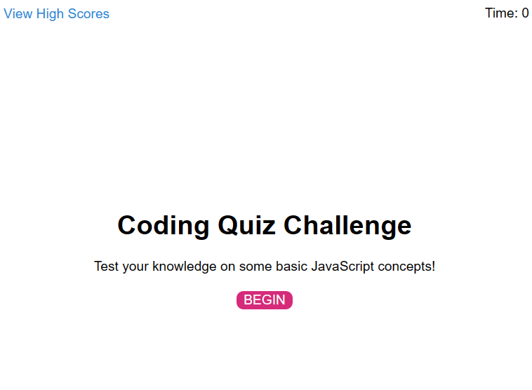
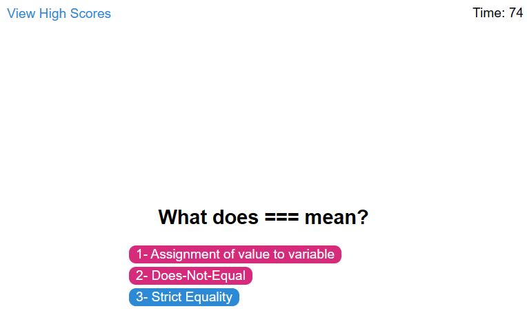
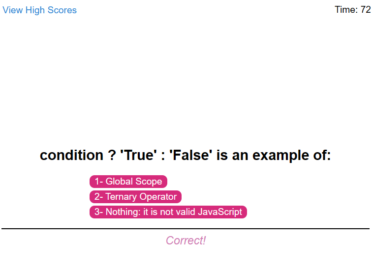
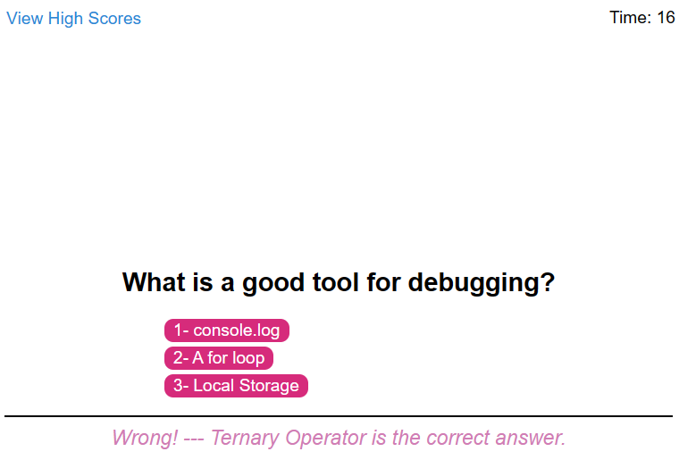
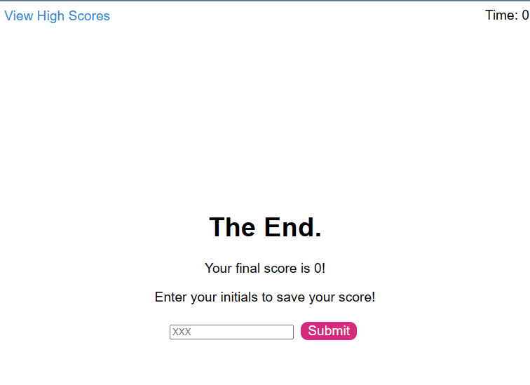
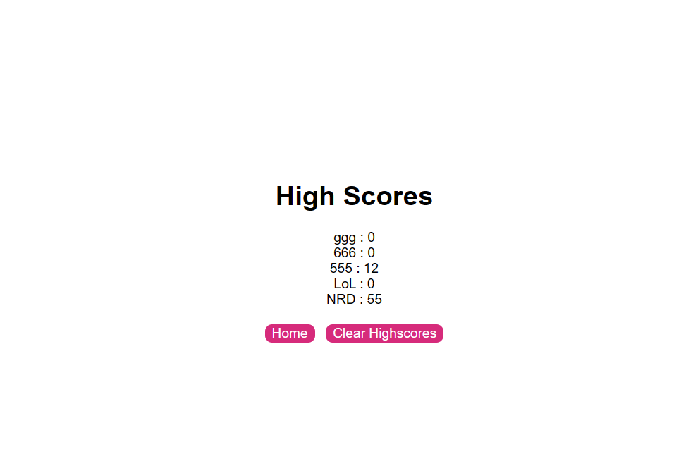

# Guessing-Game-Remix
  [](https://opensource.org/licenses/MIT)
  
  Have you ever wanted to test your basic JavaScript knowledge with a quiz that has five multiple-choice questions about basic JS info? 

  This is it, you've found it.

  Two of the questions are definitely not answered in the "Usage" section's screenshots below.

  ---

  ## Table of Contents:
  * [Installation](#installation)
  * [Usage](#usage)
  * [License](#license)
  * [Contributing](#contributing)
  * [Tests](#tests)
  * [Questions](#questions)
  
  ---

  ## Installation:
  N/A

  ---

  ## Usage:
  Visit the link below to interact with the quiz:
  >https://d-lil.github.io/Guessing-Game-Remix/

  --- 

  
  ```md
  At the home screen you will see a link that will bring you to previous high scores (if you have completed the quiz before) and a "BEGIN" button that starts the quiz.
  ```
    
  
  ```md
  Once you click "BEGIN" you will be brought to the first question where you select from a multiple-choice list to answer the question.
  ```
  * NOTE: Once the quiz begins- a timer begins counting down in the top-right hand side of the screen that ends the quiz if it hits zero. If you get a question wrong you will also be penalized.
    
  
  ```md
  If you get the answer correct you will see "Correct!" appear below the next set of questions.
  ```
    
  
  ```md
  If you get the answer wrong you will see "Wrong! --- (The correct answer will be displayed here)"
  ```
    
  
  ```md
  When the quiz is done you can enter your initials (up to three characters) to add your score to the high score list.
  ```
  
  
  ```md
  The High Scores page will show you a list of all of your high scores. You can select the button that will clear all of the high scores, or you may click home to return to the home screen to begin your favorite quiz again.
  ```
    
    
  ---

  ## License:
  The MIT License (MIT)

      Copyright (c) undefined undefined
      
      Permission is hereby granted, free of charge, to any person obtaining a copy of this software and associated documentation files (the "Software"), to deal in the Software without restriction, including without limitation the rights to use, copy, modify, merge, publish, distribute, sublicense, and/or sell copies of the Software, and to permit persons to whom the Software is furnished to do so, subject to the following conditions:
      
      The above copyright notice and this permission notice shall be included in all copies or substantial portions of the Software.
      
      THE SOFTWARE IS PROVIDED "AS IS", WITHOUT WARRANTY OF ANY KIND, EXPRESS OR IMPLIED, INCLUDING BUT NOT LIMITED TO THE WARRANTIES OF MERCHANTABILITY, FITNESS FOR A PARTICULAR PURPOSE AND NONINFRINGEMENT. IN NO EVENT SHALL THE AUTHORS OR COPYRIGHT HOLDERS BE LIABLE FOR ANY CLAIM, DAMAGES OR OTHER LIABILITY, WHETHER IN AN ACTION OF CONTRACT, TORT OR OTHERWISE, ARISING FROM, OUT OF OR IN CONNECTION WITH THE SOFTWARE OR THE USE OR OTHER DEALINGS IN THE SOFTWARE.

  ---

  ## Contributing:
  N/A
  
  ---

  ## Tests:
  N/A
  
  ---

  ## Questions:
  If you have questions, you may contact me on [GitHub](https://github.com/d-lil) or you may reach out by contacting Daniel Liljegren at dahneel@gmail.com
